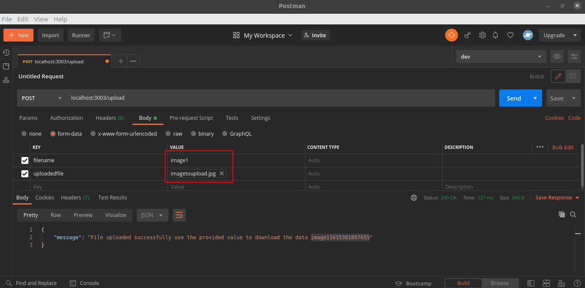
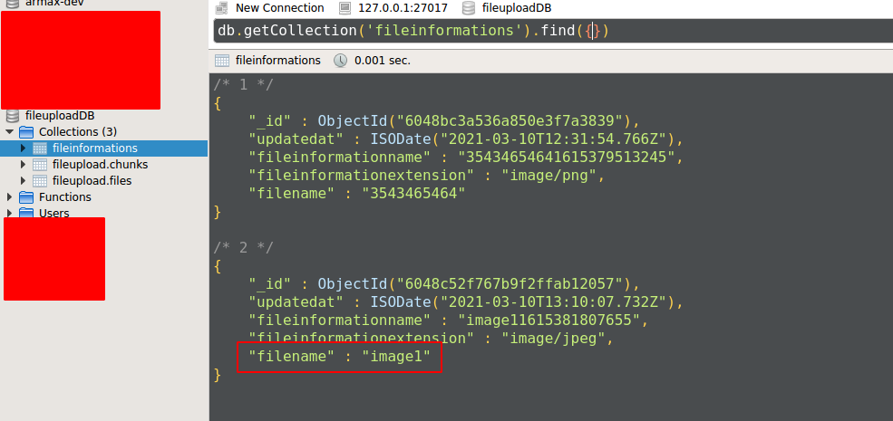
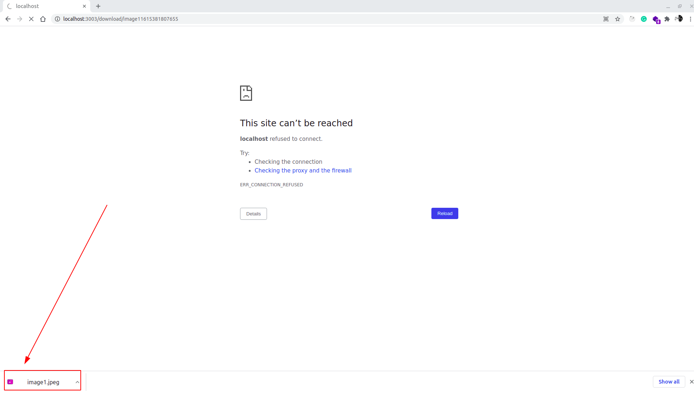

# Project Name
> Project defines how to upload and download a file into mongdb 
<hr>


## Setup
To run this project, install it locally using npm:

``` 
$ npm install
$ npm start
```
Create an .env file and store the below variables into it.
``` 
APPLICATIONPORT=3003
MONGOCONNECTIONSTRING=mongodb://localhost:27017/fileuploadDB
```

## Screenshots
Image upload using the spcified mandatory body information.

<hr>
File Information Stored into the database along with the file and chunks


<hr>
Dow loading the image based on the provided fileinformationame while did the post method.


<hr>